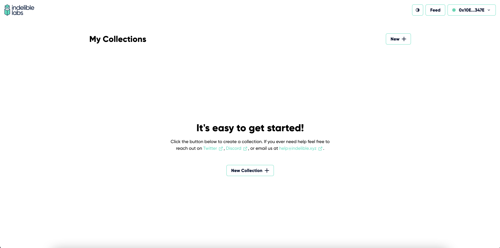
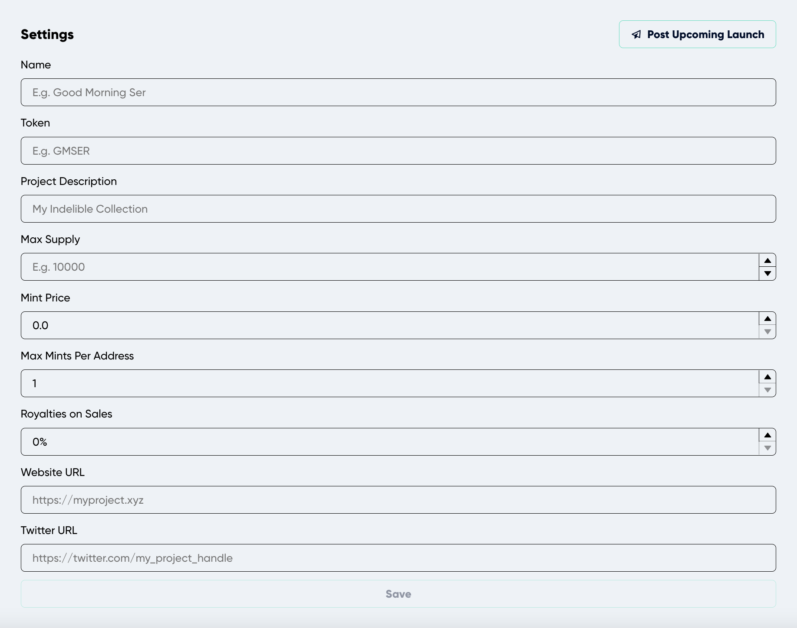
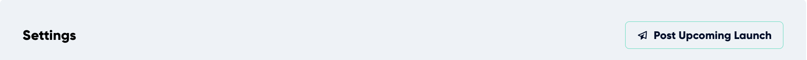

---
# Page settings
layout: default
keywords:
comments: false

# Hero section
title: Create a Collection
description: Creating a collection is simple, once you are connected and get presented with the initial screen.

# Micro navigation
micro_nav: true

# Page navigation
page_nav:
    prev:
        content: Introduction
        url: '/pages/introduction'
    next:
        content: Next page
        url: '#'
---

## Create a Collection

Creating a collection is simple, once you are connected and get presented with the initial screen. You can just click on “New +” button.

This will take you to the “New Collection” page where you need to fill out the initial settings information of the collection you want to make.

## Settings

The settings of your collection is a crucial part of the process since it will dictate all the configuration, information and behavior of your contract which for some cases, are permanent changes that cannot be edited once the contract is deployed. ***See the list of settings attributes that are immutable once the contract is deployed.***

New collections are required to fill some basic information **(every information filled in ‘New Collection Settings’ can be edited after the collection is created)**:

- **Name:** as it suggested, this is the name of the collection used for the display within the platform as well as for the ERC721a constructor which is also used by Etherscan and other places such URL slugs (e.g. OpenSea). This is added to the [contract-level metadata contractURI](https://docs.opensea.io/docs/contract-level-metadata), a standard set by OpenSea.
- **Token:** Symbol for your NFT.
- **Project Description:** A full description of your project description that will also be added to the contract, used throughout the platform as well as any marketplace that uses the [contractURI](https://docs.opensea.io/docs/contract-level-metadata) standard.
- **Max Supply:** The maximum amount of tokens that will ever exist in your contract (e.g. 5000), once this max supply is reached, minting is no longer possible forever.
- **Mint Price:** The price in ETH for each individual token ****to be minted (e.g. 0.005). If it is left in 0.0 the minting price in your contract will be free.
- **Max Mints Per Address:** The maximum amount of tokens an individual wallet can mint from the contract in the context of public mint.
- **Royalties on Sales:** The percentage that indicated the seller fee, this is specifically added to the [contractURI](https://docs.opensea.io/docs/contract-level-metadata) of the contract upon generation and deploy. This is not guaranteed to be enforced in other marketplaces but only for marketplaces that utilize this standard.
- **Website URL:** If you have a website dedicated to your NFT project you can specify the URL here to be displayed wherever your collection is displayed in the platform. This URL also gets added to the [contractURI](https://docs.opensea.io/docs/contract-level-metadata) of the contract upon generation and deploy.
- **Twitter URL:** Intended for the twitter url of your NFT, this will be used across the platform in places such as the feed, upcoming collections page, your minting page, etc.

## Adding Collection to "Upcoming"

Upcoming is a section in the platform’s [feed](https://app.indelible.xyz/feed). It is list of collections not yet released but a collection you are certain to release on a specific date, this is the best place to announce and let everyone in the community know what you plan to release. The platform will utilize the following information, so for the most meaningful impact of your announcement, make sure the following attributes are saved:

- Name
- Project Description
- Website URL
- Twitter URL
- Max Supply
- Max Mints Per Address
- Selected Charity (if your project will be giving to a charity)
- Upload profile and banner images.

To post your upcoming collection announcement simply click on “Post Upcoming Launch” on the right side of the Settings section title.

You will immediately see a modal where you can are required to input the future date of your release and simply click “Publish”.