---
# Page settings
layout: default
keywords:
comments: false

# Hero section
title: Creating a Collection
description: Once you are connected and get presented with the initial screen, creating a collection is simple.

# Micro navigation
micro_nav: true

# Page navigation
page_nav:
    prev:
        content: Introduction
        url: '/pages/introduction'
    next:
        content: Deploying
        url: '/pages/deploying'
---

## Before Starting

As a creator, you have two options when creating a collection: The types are: 
1.	**Generative Collection** 
2.	**Open Edition** 

### Details

##### Generative Collection
Here, layers and traits are combined in unique ways during minting to ensure each NFT artwork is distinct and cannot be duplicated (See Figure 1).

##### Open Edition
This straightforward option **does not** involve layers or traits, but offers a drag-and-drop file upload for one or more still images/artworks, resulting in identical NFTs for each image. This enables identical images to be produced, bought, and minted, providing buyers with clear knowledge of the NFT they'll receive (See Figure 1).

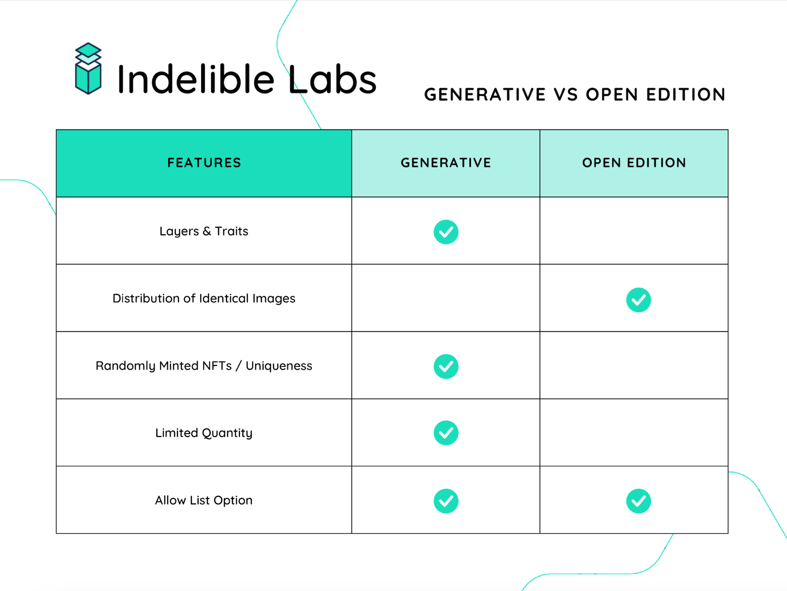

 <i><strong>Figure 1</strong></i> Comparison chart demonstrates the differences between generative and open edition collections. 

### Creating a Collection

Creating a collection is simple. Once you are connected and get presented with the initial screen, you can just click on "New +" or the "New Collection +" button (See Figure 2).

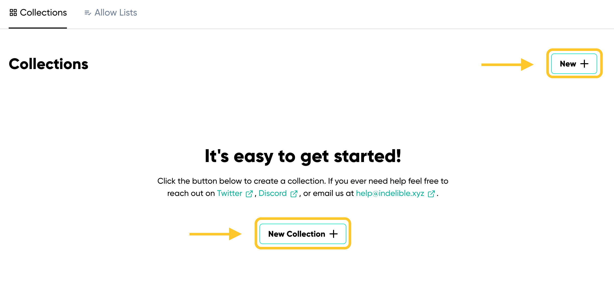

 <i><strong>Figure 2</strong></i> Demonstrates creating a collection home page

This directs you to the "New Collection" page where you can fill out the initial settings information for the collection you will be creating.

### Collection Detail Settings

Your collection settings are vital, as they determine the configuration, details, and behavior of your contract. Some of these settings become permanent upon deployment and cannot be altered. [***See the list of immutable attributes.***](#immutable-attributes)

When setting up a new collection, you'll need to provide basic details. **All details in "New Collection Settings" can be edited after creation, but but not after the contract has been deployed*** (See Figure 3). 

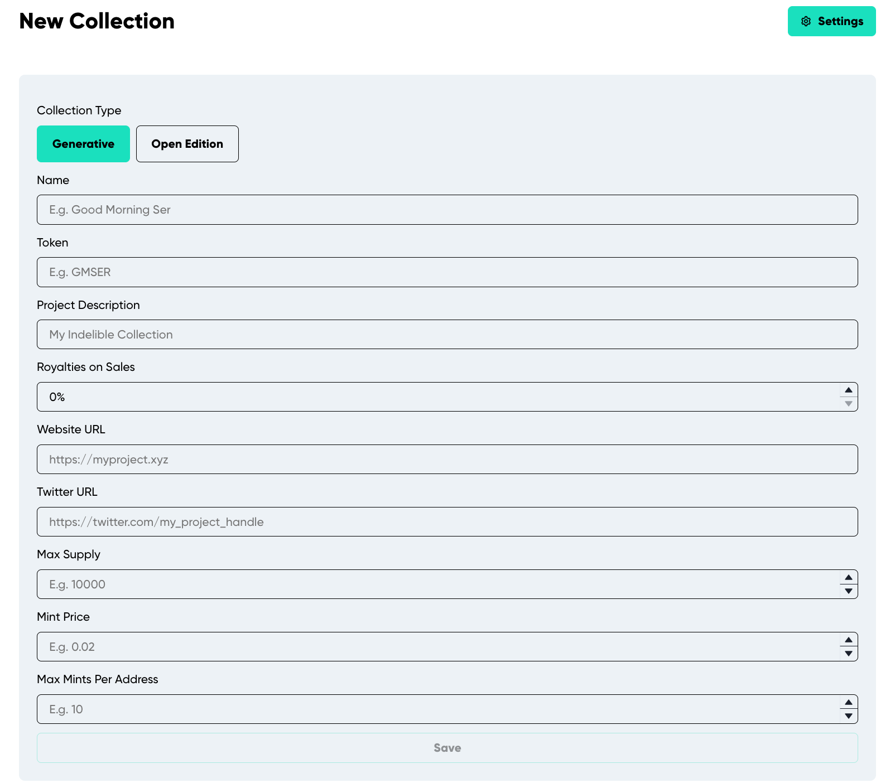

 <i><strong>Figure 3</strong></i> Demonstrates setting up the collection by adding the required initial detail. <strong>Note:</strong> The details for the "Open Edition" settings differ slightly from those of the "Generative" settings. The list below covers both.

- **Name:** The collection's display name on the platform. It is used in the ERC721a constructor and recognized by Etherscan, OpenSea, and other platforms. Included in the contract-level metadata [contractURI](https://docs.opensea.io/docs/contract-level-metadata) a standard set by OpenSea.
- **Token:** Your NFT's symbol.
- **Project Description:** A detailed description of your project. Incorporated into the contract and displayed on platforms and marketplaces recognizing the [contractURI](https://docs.opensea.io/docs/contract-level-metadata) standard.
- **Max Supply:** The cap on tokens for your contract (e.g., 5000). Once reached, minting is no longer possible
- **Mint Price:** The cost in ETH for minting each token (e.g., 0.005). If set to 0.0, the minting price in your contract is free.
- **Max Mints Per Address:** The limit on tokens a single wallet can mint publicly.
- **Royalties on Sales:** The seller fee percentage added to the [contractURI](https://docs.opensea.io/docs/contract-level-metadata) upon generation and deploy.  This is not guaranteed to be enforced in other marketplaces but only for marketplaces that utilize this standard. 
- **Website URL:** Your NFT project's website link. It is displayed on the platform and added to the contract's [contractURI](https://docs.opensea.io/docs/contract-level-metadata) upon generation and deploy.
- **Twitter URL:** The link to your NFT's Twitter account. It will be dispalyed across the platform, including: the feed, upcoming collection page, and your minting page.

### General Settings

#### Adding Collection to "Upcoming"

"Upcoming" showcases collections set to be released on a specific date in the platform’s [feed](https://app.indelible.xyz/feed). It's an announcement platform for the community to preview what's coming next.

#### How to Post a Collection to "Upcoming"  

1. Create a "New Collection" and fill out all the necessary details.
2. Click "Save" at the bottom of the page.
3. This will redirect you to a new page with the "General" section as the default, featuring the "Post Upcoming Launch" option (See Figure 4).

<i><strong>Figure 4</strong></i> Demonstrates how to post a collection to "Upcoming.". <strong>Note:</strong> The general settings details shown in Figure 4 for the "Generative" collection differ slightly from those of the "Open Edition" collection general settings. 

*For the most effective announcement, ensure the following details are filled out:* 

**Details for Generative Collection:**
- Name
- Token
- Project Description
- Royalties on Sales
- Website URL
- Twitter URL
- Max Supply
- Mint Price
- Max Mints Per Address

**Details for Open Edition Collection:**
- Name
- Token
- Project Description
- Royalties on Sales
- Website URL
- Twitter URL
- Mint Price
- Max Mints Per Address

##### How to Announce Your Collection in "Upcoming" (See Figure 5).
1. Click "Post Upcoming Launch" located on the right side of the Settings section.
2. A prompt will appear, asking for the release date of your collection.
3. Input the date and click "Publish."

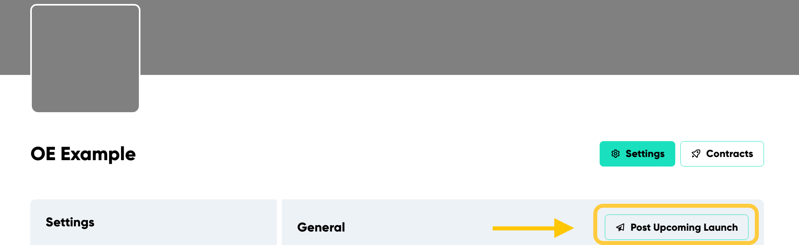

<i><strong>Figure 5</strong></i> Demonstrates where to locate the "Post Upcoming Launch" button.

You will immediately see a modal where you can are required to input the future date of your release and simply click "Publish."

### Allow List Settings 

To use the allow list settings, **first** create an allow list. Here are two ways to do it:

1. On the initial collection creation page, before hitting "New +", click the "Allow Lists" option at the top left. Follow the guided steps (See Figure 6).
2. Alternatively, if you are already on the settings page of creating your collection, find and click the "Allow List" button under "General". Then click "New +" next to the "Allow List" title in the section's top right corner (See Figure 7).

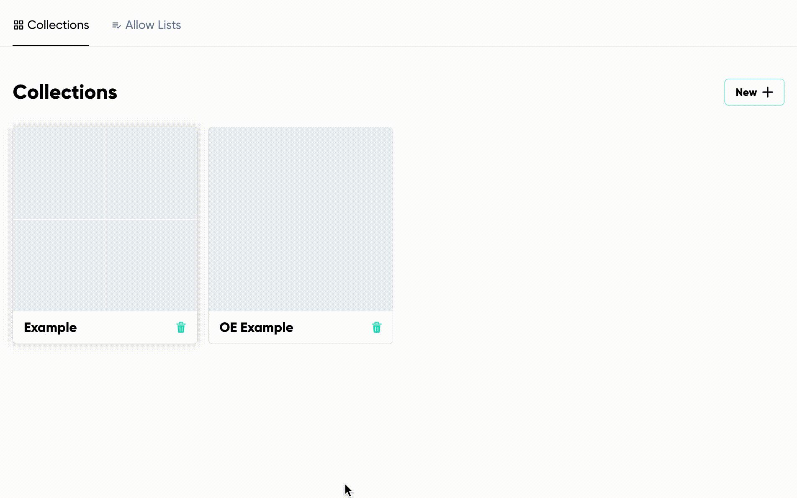

<i><strong>Figure 6</strong></i> Demonstrates where to locate the first option for creating the "Allow Lists."

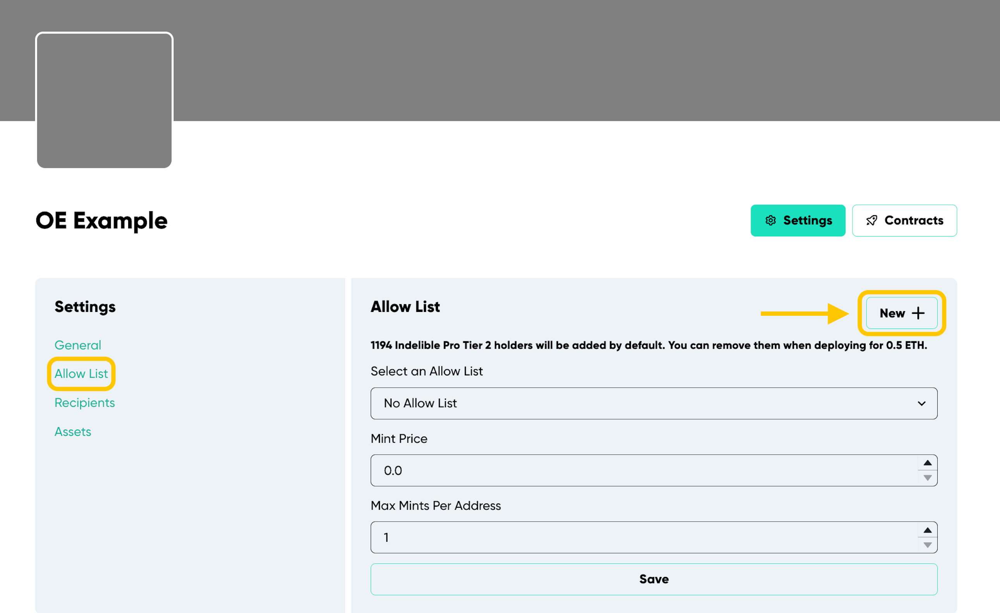

 <i><strong>Figure 7</strong></i> Demonstrates where to locate the second option for creating the "Allow Lists."

This section allows you to add wallet addresses to an allow list for minting when the contract goes live.

1. To add addresses:
- Go to the Addresses section.
- Input each wallet address on a separate line.
2. Set the "Mint Price" to determine the ETH cost for allow list wallets. This **can** be different than the public mint price in the settings section
3. Lastly, adjust "Max Mints Per Address" to specify how many tokens a wallet can mint from the contract during allow list minting. This **can also** be different than the “Max Mints Per Address” in the settings section.

### Recipients

Under the "Allow List" settings, find the "Recipients" button.

Recipients are the wallets designated to receive ETH earnings from token minting or other contract earnings. This is vital for collections considering a paid mint, facilitating trust free partnerships with other individuals.

When withdrawing earnings, the contract will automatically distribute ETH percentages to wallets based on the specified settings. By default, your wallet receives 100% of the earnings. When you add other recipients, your percentage reduces accordingly.

**Note:** Secondary royalty sales are excluded from this arrangement.

### Charity

Under the "Allow List" settings, find the "Recipients" button. Then click “New +” next to the “Allow List” title in the section’s top right corner.

This feature is powered by [The Giving Block](https://thegivingblock.com/)

Easily allocate a portion or all of your earnings to charity within the recipient settings. To do this: 
1. Click "Add Charity" next to the “Recipients” title in the section’s top right corner (See Figure 8). 
2. Search amongst 1674 organizations for your preferred organization
3. Select "Add" and specify the percentage you wish to donate.

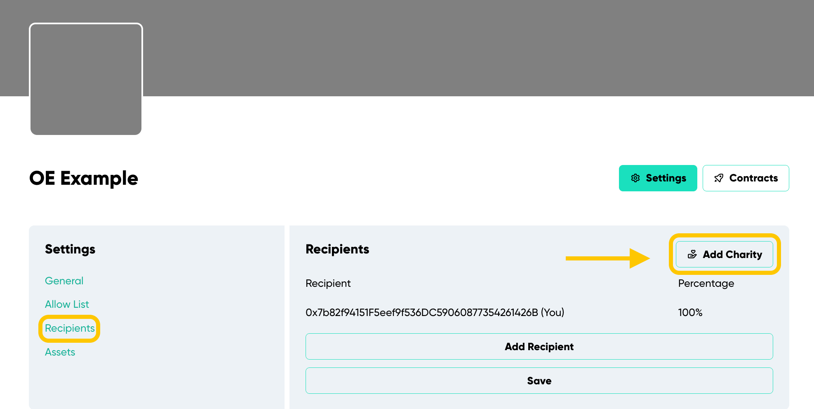

 <i><strong>Figure 8</strong> </i>Demonstrates where to locate the "Add Charity" button.

### Assets

Under the "Recipients" settings, find the "Assets" button (See Figure 9).

Use this section to upload a profile and banner image for your collection. The profile image integrates into the contract's URI. To best represent your collection:

- Use a square image for the profile.
- For the banner, an aspect ratio of 4.3 is optimal (e.g. 430x100 px, 1720x400 px).

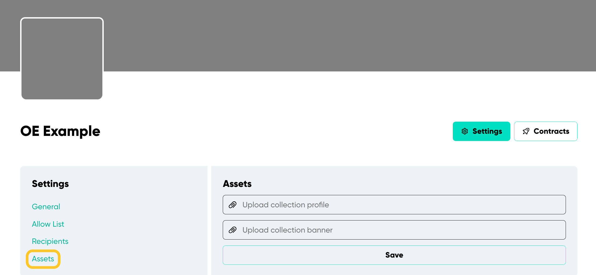

 <i><strong>Figure 9</strong> </i>Demonstrates the "Assets Section" for a collection.

## Creating A Generative Colletion

"Generative" and "Open Edition" collections have distinct settings. **For generative collections, the art is produced before deployment.** You can find its unique items for creation next to the collection's settings (See Figure 10).

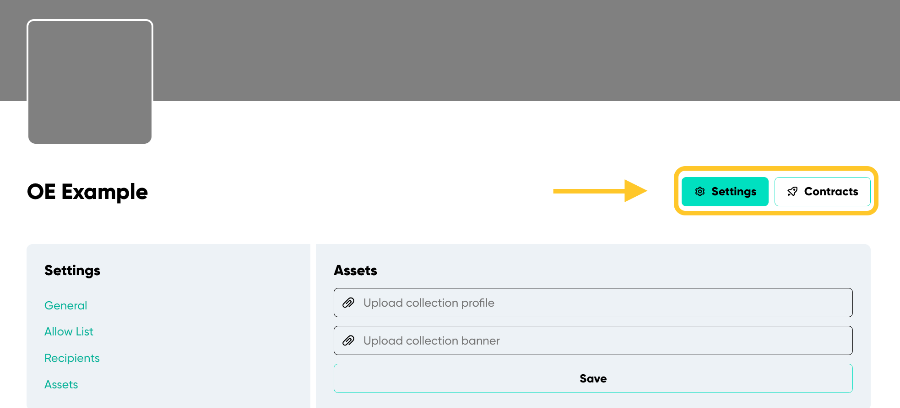

 <i><strong>Figure 10</strong> </i>Demonstrates the Generative collection's unique settings. The options presented are: "Settings," "Layers," "Preview," and "Estimates".

### Layers and Traits

- Layers: Are the categories or components of the artwork.
- Traits: Are specific attributes or items within those categories.

For example, if we look at any [OCK NFT](https://opensea.io/collection/onchainkevin) and look at the properties section, we see an image similar to the one below (See Figure 11).

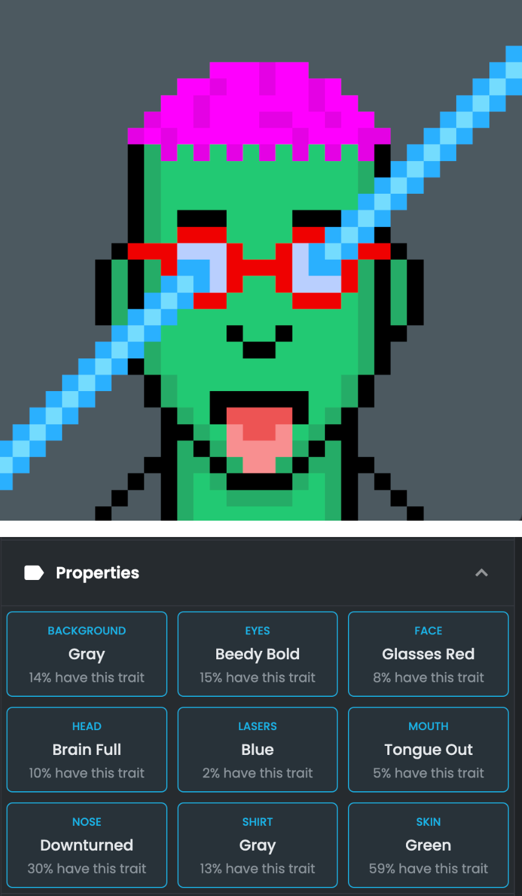

 <i><strong>Figure 11</strong> </i>Demonstrates a sample NFT and its layers and traits.

- The **Layers** include: background, eyes, face, head, lasers, mouth, nose, shirt, and skin.
- The **Traits** specify: gray, beedy bold, glasses red, brain full, blue, tongue out, downturned, gray, and green.

#### Layers

Click the "Layers" button next to "Settings" in the collection menu to add layers.

Simply enter the names of the layers you want in your collection. There's a limit of 15 layers in total. To rearrange them, drag and drop using the dotted icons next to the text box (See Figure 12).

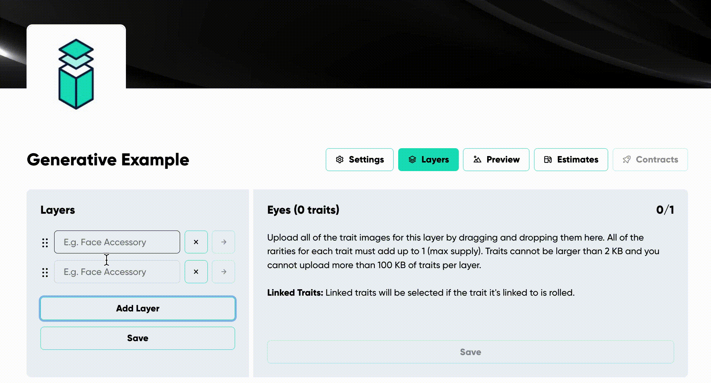

 <i><strong>Figure 12</strong> </i>Demonstrates the process of adding layers when creating a Generative collection.

#### Traits

Upload traits in the "Background" section located to the right of your layers (See Figure 13.1).

##### To add traits to a layer:

1. Click on a layer's arrow, which can be founded right next to it.
2. Drag and drop the desired traits onto it.

 <i><strong>Figure 13.1</strong></i> Demonstrates where to upload traits and how to do so.

In order to save traits, the trait rarity needs to be declared (See Figure 13.2).

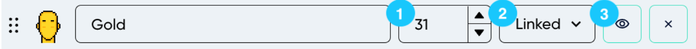

 <i><strong>Figure 13.2</strong></i> Demonstrates how to save traits.

1. **Rarity:** The lower the number of trait, the more rare the trait will be. All traits ***inside*** of a layer should equal the **"Max Supply"** set in the settings.
2. **Linked Traits (Dropdown):** Traits can be paired with other traits from different layers to make them appear together. For example, to exclusively match the "gold" skin with the 'third eye' head trait, simply link them via the dropdown. This will guarantee that any "gold" selection will feature a "third eye."

**Note:** A single trait can be linked to several others.  If you want the "gold" skin to be paired with both "monkey hat" and "flames" from the "head" layer, just link the "gold" skin to both. This will ensure the "gold" skin is chosen whenever "monkey hat" or "flames" is selected.

3. **Hide:** Use the eye-icon button to make a trait invisible in the metadata. The trait will appear in the image but won't be mentioned in the NFT's property description.

#### Immutable Attributes

**Once set, these attributes are *permanent*.** Double-check the following for accuracy before deployment:

- Max Supply
- Mint Price (For Public Mint)
- Recipients (including charity organizations)

## Creating An Open Edition Colletion

"Generative" and "Open Edition" collections have distinct settings. **In an open edition collection, unlike a generative collection, the art is uploaded after deployment.** For details on the art creation process in an open edition collection, please see the "Managing Your Contract" page.
