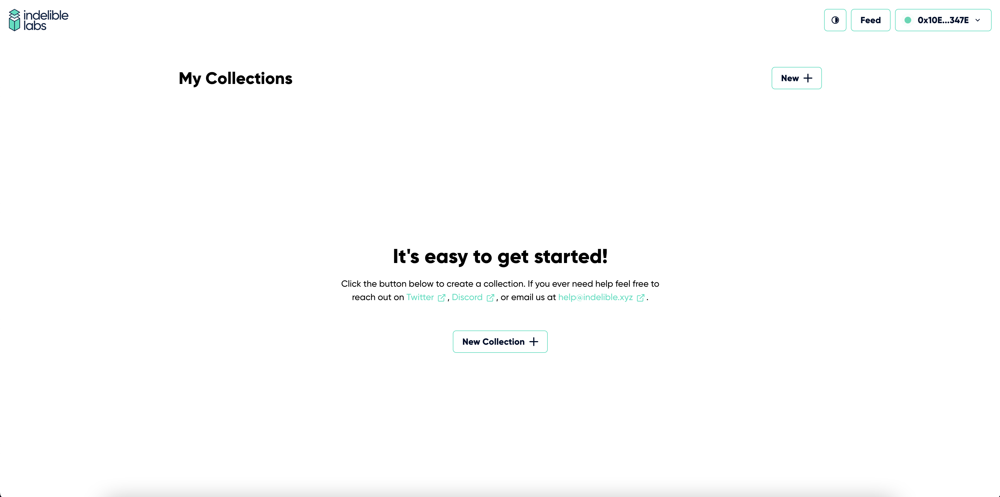
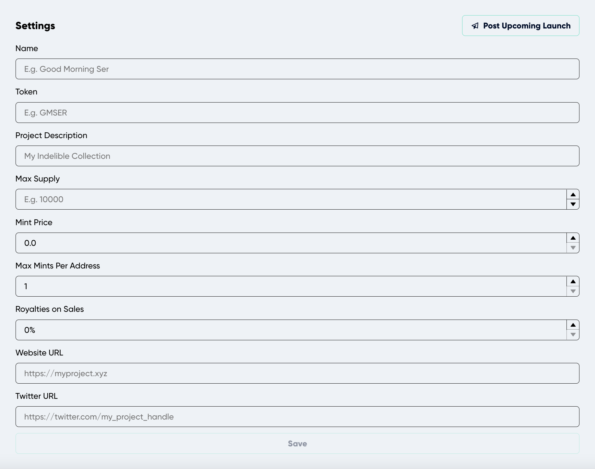
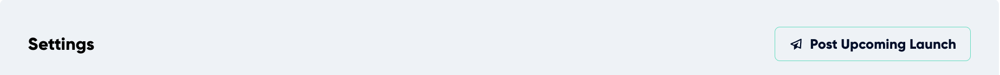
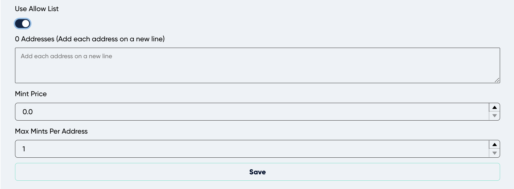
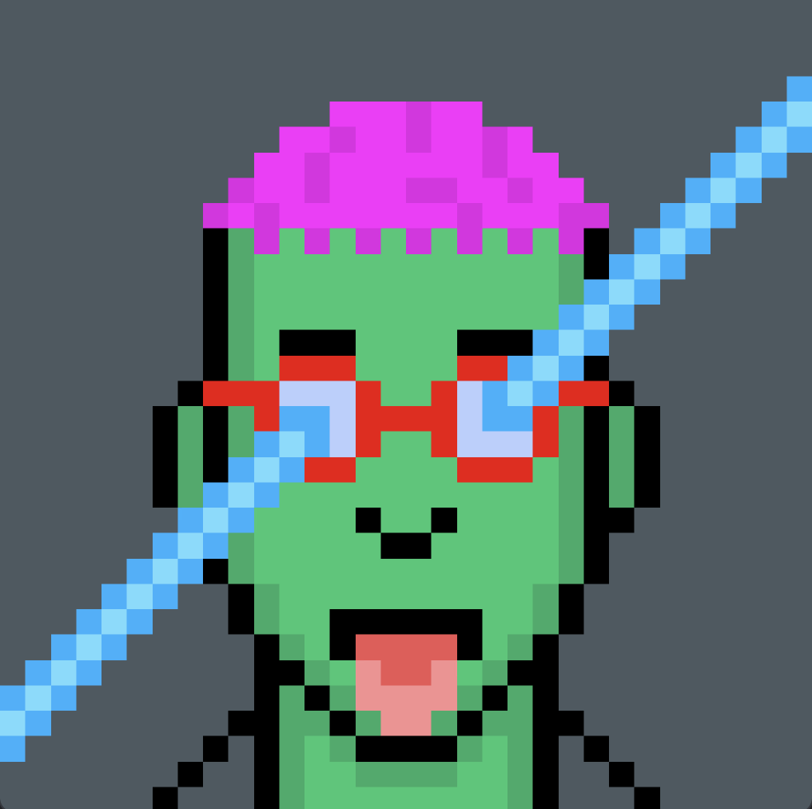
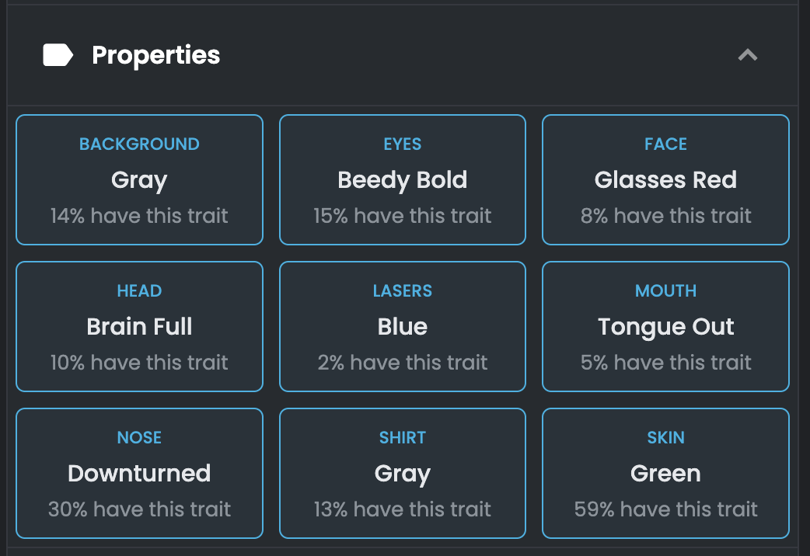
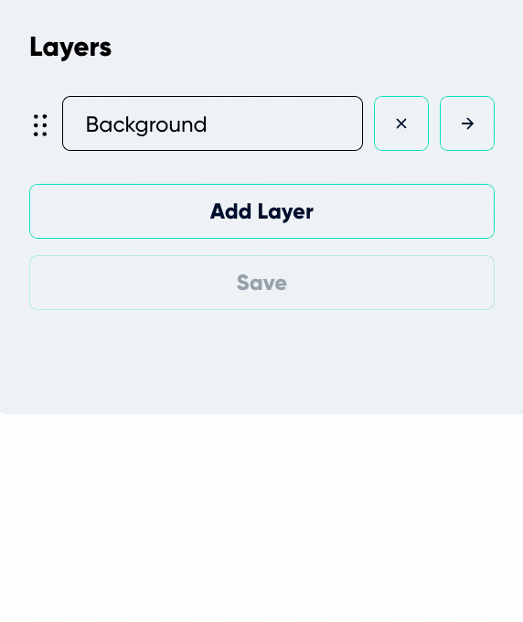
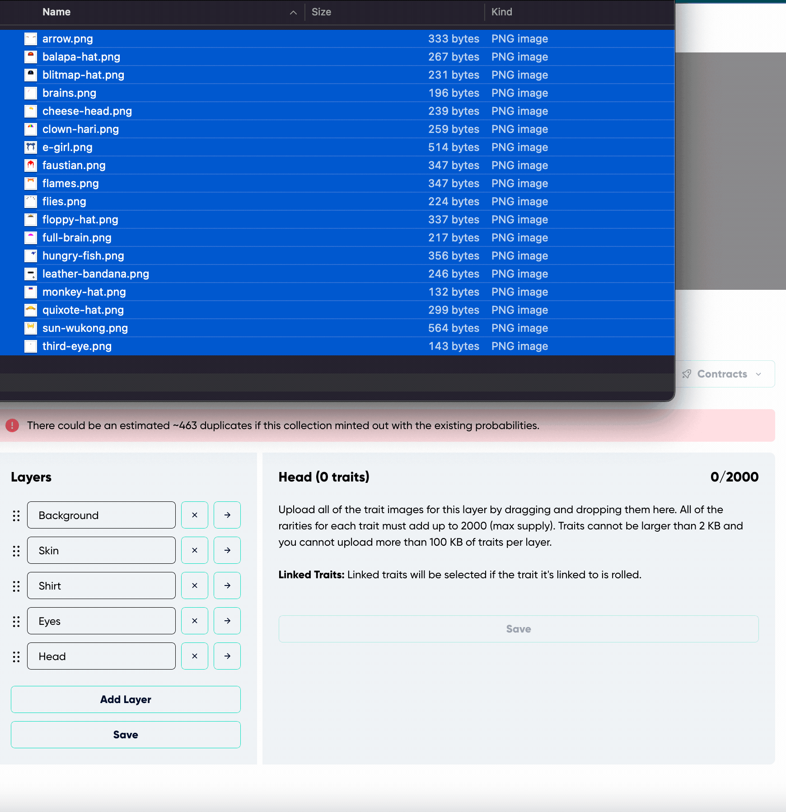
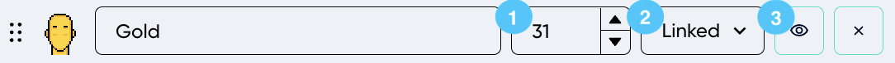

---
# Page settings
layout: default
keywords:
comments: false

# Hero section
title: Create a Collection
description: Once you are connected and get presented with the initial screen, creating a collection is simple.

# Micro navigation
micro_nav: true

# Page navigation
page_nav:
    prev:
        content: Introduction
        url: '/pages/introduction'
    next:
        content: Deploying
        url: '/pages/deploying'
---

## Create a Collection

Creating a collection is simple. Once you are connected and get presented with the initial screen, you can just click on “New +” button.

This will take you to the “New Collection” page where you need to fill out the initial settings information of the collection you want to make.

## Settings

The settings of your collection are a crucial part of the process since it will dictate all the configuration, information, and behavior of your contract, which for some cases are permanent changes that cannot be changed once the contract is deployed. [***See the list of immutable attributes.***](#immutable-attributes)

New collections are required to fill some basic information **(every information filled in "New Collection Settings" can be edited after the collection is created)**:

- **Name:** as it suggested, this is the name of the collection used for the display within the platform as well as for the ERC721a constructor which is also used by Etherscan and other places such URL slugs (e.g. OpenSea). This is added to the [contract-level metadata contractURI](https://docs.opensea.io/docs/contract-level-metadata), a standard set by OpenSea.
- **Token:** Symbol for your NFT.
- **Project Description:** A full description of your project description that will also be added to the contract, used throughout the platform as well as any marketplace that uses the [contractURI](https://docs.opensea.io/docs/contract-level-metadata) standard.
- **Max Supply:** The maximum amount of tokens that will ever exist in your contract (e.g. 5000), once this max supply is reached, minting is no longer possible forever.
- **Mint Price:** The price in ETH for each individual token ****to be minted (e.g. 0.005). If it is left in 0.0 the minting price in your contract will be free.
- **Max Mints Per Address:** The maximum amount of tokens an individual wallet can mint from the contract in the context of public mint.
- **Royalties on Sales:** The percentage that indicated the seller fee, this is specifically added to the [contractURI](https://docs.opensea.io/docs/contract-level-metadata) of the contract upon generation and deploy. This is not guaranteed to be enforced in other marketplaces but only for marketplaces that utilize this standard.
- **Website URL:** If you have a website dedicated to your NFT project you can specify the URL here to be displayed wherever your collection is displayed in the platform. This URL also gets added to the [contractURI](https://docs.opensea.io/docs/contract-level-metadata) of the contract upon generation and deploy.
- **Twitter URL:** Intended for the twitter url of your NFT, this will be used across the platform in places such as the feed, upcoming collections page, your minting page, etc.

## Adding Collection to "Upcoming"

Upcoming is a section in the platform’s [feed](https://app.indelible.xyz/feed). It is list of collections not yet released but a collection you are certain to release on a specific date, this is the best place to announce and let everyone in the community know what you plan to release. The platform will utilize the following information, so for the most meaningful impact of your announcement, make sure the following attributes are saved:

- Name
- Project Description
- Website URL
- Twitter URL
- Max Supply
- Max Mints Per Address
- Selected Charity (if your project will be giving to a charity)
- Upload profile and banner images.

To post your upcoming collection announcement simply click on “Post Upcoming Launch” on the right side of the Settings section title.

You will immediately see a modal where you can are required to input the future date of your release and simply click “Publish.”

## Recipients

Recipients are the wallets that will be receiving the ETH earnings from the token mint or other earnings from the contract, which is specially important for collections that are planning a paid mint. This allows for trust free partnerships with other individuals.

Upon withdraw of the earning from the contract, the contract will automatically send the percentage in ETH to the wallet according to what was specified here. The default settings wallet address is your own wallet with 100% of the earnings **AFTER** the platform’s fee. When adding other recipient wallets your percentage will be automatically subtracted.

**Note:** This does not apply to secondary royalty sales.

### Charity

This feature is powered by [The Giving Block](https://thegivingblock.com/)

Adding a charity organization inside of recipients is incredibly easy, whether you want 100% of your earnings to go to a charity organization or a specified percentage. Just click on “Add Charity” in the recipient section, search for the organization of your choice, simply click “Add”, and add to that organization the percentage you desire to give.

## Allow List

When toggled on, this enables you to add your own list of wallet addresses to be included in the allow list portion of the minting process when the contract is deployed. 

The Addresses section is where you can add the wallet addresses for your allow list ***(each address needs to be in their own line).***

"Mint price" is the ETH price for the allow list wallets (this **CAN** be different than the public mint price in the settings section).

"Max Mints Per Address" is the maximum amount of tokens an individual wallet can mint from the contract in the context of allow list mint. This also can be different than the “Max Mints Per Address” in the settings section.

## Assets

This section is simply for you to upload a profile and banner image to your collection. The profile picture gets added to the contractURI of the contract. These are used to best showcase your collection. The profile picture is best as a square image and the banner is optimized for an aspect ratio of 4.3 (e.g. 430x100 px, 1720x400 px).

## Layers and Traits

Found in the collection menu items next to settings. Layers can be thought of as the categories of things that compose the art, and the traits are the items inside that category. For example, if we look at any [OCK NFT](https://opensea.io/collection/onchainkevin) and look at the properties section, we see something like this:

The **Layers** here are: background, eyes, face, head, lasers, mouth, nose, shirt, and skin. Whereas the **Traits** are: gray, beedy bold, glasses red, brain full, blue, tongue out, downturned, gray, and green.

### Layers

To add all your layers, you just simply type the name of your layers you are planning to have in your collections. You can add more layers with a limit of 15 in total. You can change the sorting on the layers by dragging and dropping from the dotted icons left of the text box.

### Traits

Traits for each layer can be uploaded by going to the traits of the selected layer (clicking on the arrow of a selected layer) and dragging and dropping the traits.

In order to save traits, the trait rarity needs to be declared.

1. **Rarity:** The lower the number of trait, the more rare the trait will be. All traits ***inside*** of a layer need to add up to the "**Max Supply**" number that was inputted in settings.
2. **Linked Traits (Dropdown):** Traits can be linked to other traits in other layers in order for them to appear together exclusively. For example, let’s say we want “gold” skin to only have a head layer trait of ‘third eye’. Then on this dropdown that belongs to "gold" we would search for ‘third eye’ and this will make it to where everyone that gets "gold" will have a "third eye".
A trait can be linked to multiple other traits. For example, if we have “third eye”, “monkey hat”, and “flames” as our traits inside of “head” Layer and we want “gold” Skin to show up with "monkey hat" and "flames", we can select “gold” skin as a linked trait for both “monkey hat” and “flames”. This would make it to where every time “monkey hat” or “flames” is selected the skin would be always be gold.
3. **Hide:** The eye-icon button for every trait will hide that specific trait from the metadata; meaning the trait will still show up in the image if it is selected, but the properties' description of that NFT will not display that trait.

## Immutable Attributes

**THESE ATTRIBUTES CAN'T EVER BE CHANGED AFTER DEPLOY.** Make sure these are exactly how you want them before deploying:
- Max Supply
- Mint Price (For Public Mint)
- Recipients (including charity organizations)
