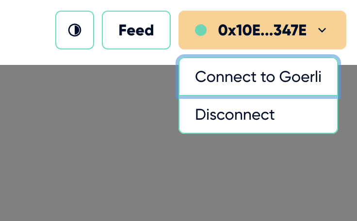
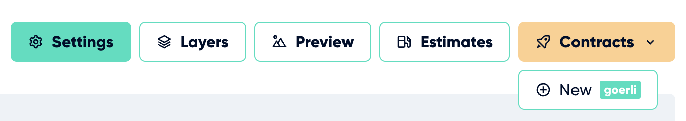

---
# Page settings
layout: default
keywords:
comments: false

# Hero section
title: Deploying
description: Deploying is the final step once your collection is 100% ready.

# Micro navigation
micro_nav: true

# Page navigation
page_nav:
    prev:
        content: Create a Collection
        url: '/pages/create-a-collection'
    next:
        content: Next page
        url: '#'
---

# Deploying

This step should only be considered once you have all your information about your project saved and entirely completed to where you are ready to launch, as well as have checked in “Preview” section (just an estimate on generation and outcome).

**The platform enforces a deployment to Ethereum testnet “Görli” for all collection before going to Ethereum mainnet.** It is also best practice to release to a testnet first, since it cannot be stressed enough that once you deploy to mainnet it is final and if you made a mistake you cannot get your ETH back. *Görli utilizes test ETH that can be adquired easily and for free.*

## Testnet

If it is the first time a collection is being released at all (both testnest and mainnet), the platform will require and enforce a deploy to testnet first. You can switch to Görli manually by clicking on your wallet on the top right of the platform and selecting “Connect to Goerli”.

Once you have done that you can Click on the “Contracts” dropdown and select “New” to start the deployment process.

## Mainnet

Only when you are 100% sure should you proceed with the mainnet deployment. The good news is that the process is exactly the same for mainnet as it was for testnet.