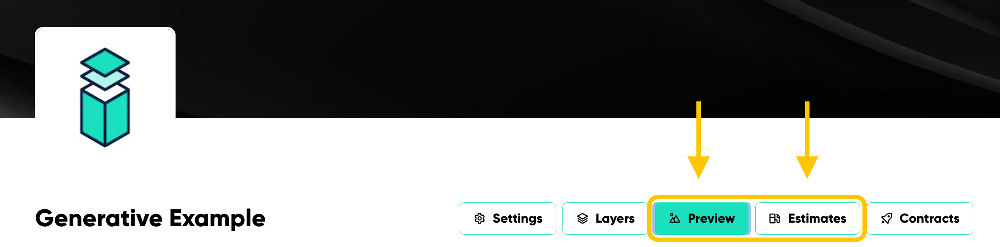
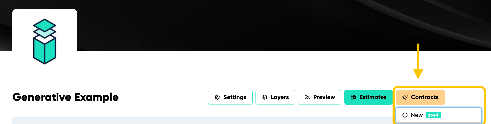

---
# Page settings
layout: default
keywords:
comments: false

# Hero section
title: Deploying
description: Deploying is the final step once your collection is 100% ready.

# Micro navigation
micro_nav: true

# Page navigation
page_nav:
    prev:
        content: Creating a Collection
        url: '/pages/create-a-collection'
    next:
        content: Managing Your Contract
        url: '/pages/manage-your-contract'
---

### Before Deploying

Before deploying (generative), review the "Preview" and "Estimates" sections (Refer to Figure 14):

"Preview:" shows the visual result of the art.
"Estimates:" displays the upload cost.

<i><strong>Figure 14</strong></i> Demonstrates where to locate the "Preview" and "Estimates" button.

### Deploying

Only proceed with this step **after** you have completed and saved all the information about your project and are prepared to launch. 

**The platform enforces all collections to first deploy to a testnet before moving to any mainnet.** By default, the platform uses the Goerli testnet. To change this, click on your address beside the "Feed" button at the top right, and select "Change Network."

It is essential to test first, as mistakes on the mainnet are **permanent** and could result in lost ETH.

**Note:** Fortunately, all testnets utilizes test ETH or test Matic that can be adquired easily and for free (on faucets).

### Testnet

Every collection's initial release mandates a testnet deployment. 

1. To connect to Goerli (the default choice, unless adjusted to another testnet as mentioned earlier), click "Contracts" at the top right of the platform.
2. Afterward, select “New” to start the deployment process (See Figure 15).

<i><strong>Figure 15</strong></i> Demonstrates where to locate the "Contracts" dropdown in order to start the deployment process.

### Mainnet

Only move forward to mainnet deployment when you are entirely confident in your collection. Once deployed to mainnet, it becomes **permanent and unchangeable.** The good news is that the process is exactly the same for mainnet as it was for testnet.

### Important Recap of Deployment:

1. Firstly, deploy to the testnet. If you do not have a testnet, you'll need to set one up. 
2. Once deployed to testnet and test everything, you can proceed to deploy on the mainnet. It is crucial to note that you **cannot make changes after taking this step.** Any modification will require a fresh testnet deployment.
    - This measure ensures consistency between what is deployed on the testnet and the mainnet, minimizing mistakes.
3. Once your collection is deployed to the mainnet, it is final. The entire collection becomes locked, preventing any further edits that are not found in "managing your contrat".
    - If you wish to make changes and redeploy to the mainnet, clone the original collection in the Indelible Labs app, make the necessary tweaks, and then redeploy.
