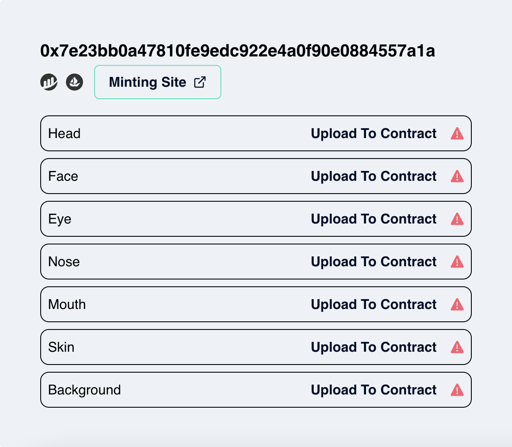
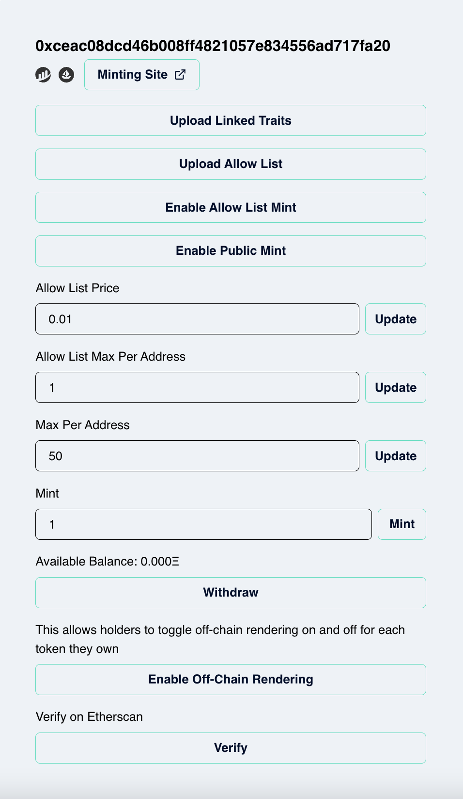
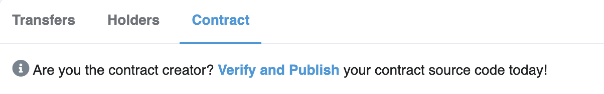

---
# Page settings
layout: default
keywords:
comments: false

# Hero section
title: Manage Your Contract
description: Interact with your contract to manage different aspects of your minting process and more.

# Micro navigation
micro_nav: true

# Page navigation
page_nav:
    prev:
        content: Deploying
        url: '/pages/deploying'
---

# Overview

Your contract deployed successfully! After this happens, there are some crucial things you need to manage in your contract in order for the world to start minting your tokens.

For quick reference, here are the interactions you need to do with your contract before anyone can mint:

- Upload all layers.
- If you declared any "Link traits", upload the link traits.
- If you enabled “Allow list” for your contract, you must upload the "Allow list" to your contract.
- Toggle the desired minting option.

# Uploading the layers

After the deployment is successful, you will immediately be taken to the specific page to manage your contract and be presented with the ability to upload your layers to your contract that is now in the Ethereum blockchain. However, nothing else can be done without first completing the upload of your layers. As a way to mitigate heavy transactions and avoid uploading too much data into the Ethereum blockchain all at once, your art is not uploaded to the contract at the same time the contract got deployed.

What you will see right after succesfully deploying is the following:

Here you must individually click on each “Upload To Contract” button for every layer, therefore writing all the traits for that layer into your contract. Once all these are uploaded successfully, your art is now entirely on-chain.

# General Management

Indelible Labs offers all the interface necessary for the management of your contract to be easy. Let's look at all the possible interactions you can do.

Once you uploaded all your layers the following options are what you would see and use to manage your contract going forward:

## Upload Linked Traits

If you used the "Linked trait" feature on any of the traits in your collection, you **MUST** click and upload your linked traits to the smart contract **prior** to any minting if you do not want undesired outcomes on the art.

## Upload Allow List

Use this to upload your list. Currently the allow list does not upload along with the contract so this is an interaction you must do if you have an allow list and you want those wallets to mint.

## Enable/Disable Allow List Mint

After you upload your allow list to your contract. To open minting up to those allowed wallets, click this to enable. You can always disable after if you want to close it up again.

## Enable/Disable Public Mint

Toggle this to open minting to anyone.

## Allow List Price

Controls the allow list price per token to be minted.

## Allow List Max Per Address

Controls the max amount of tokens a single allow list address can mint.

## Mint

This is for you to exclusively mint from the contract. There are many reasons you might want to do this, such as airdrop, mint the first N number of tokens, or you simply just want to see your art on mainnet first.

## Withdraw

For any collection that earn ETH on mint. You can trigger the withdraw method with this button to collect your share from the contract’s available balance at any given time.

## Enable Off-Chain Rendering

You must toggle this on to allow the owners of the tokens to have the ability to toggle off-chain rendering for their particular token.

Currently Indelible Labs offers free hosting for the images of your collection if it is desired. Note that this is subject to change.

Your contract is designed to return either the on-chain image or an off chain url in the `tokenURI` method if this is enabled by the owner of the token. The number one reason for this at this current time is to be able to display the NFT in twitter PFP.

## Verify

This is done automatically upon deploy, but because we work with multiple external services and APIs it is not guaranteed to succeed. Although your contract will be uploaded, the verification might fail in which case you can always attempt to verify here. To know whether your contract has been verified or not by Etherscan, simply go to your contract on Etherscan and click on the contract tab. If your contract is **NOT** verified, you should see this.

