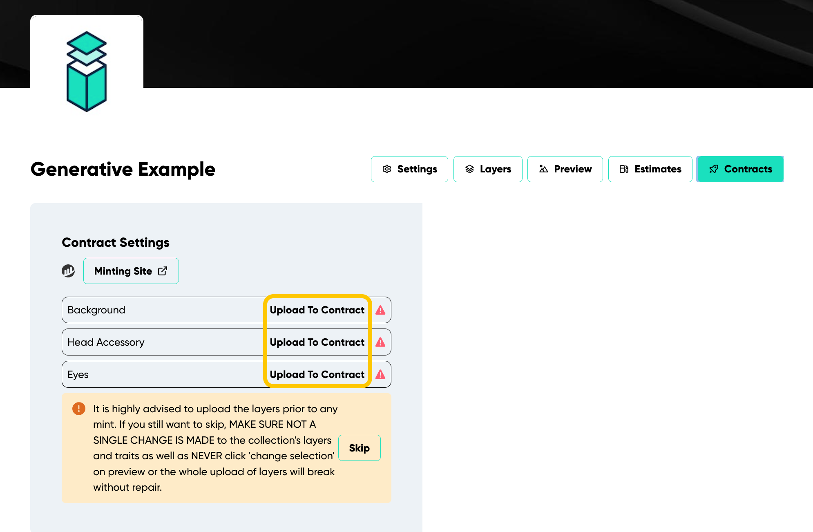
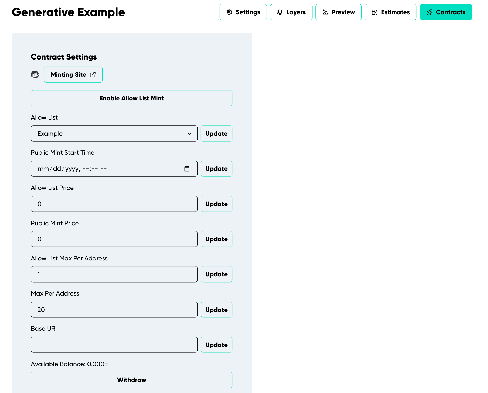
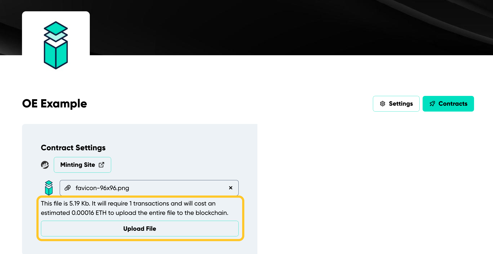
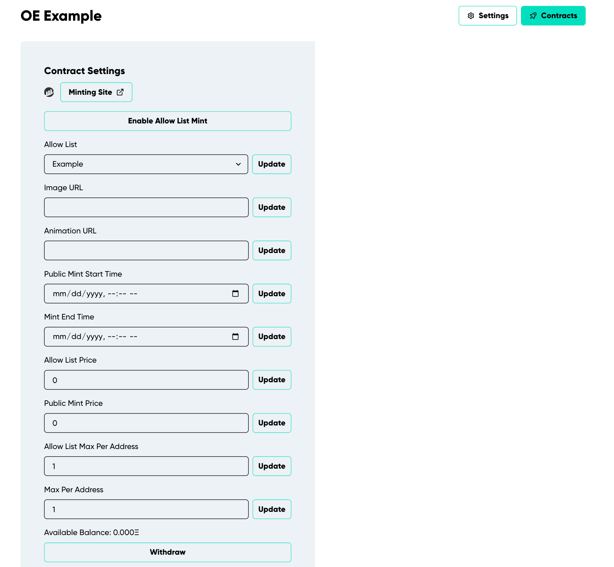

---
# Page settings
layout: default
keywords:
comments: false

# Hero section
title: Managing Your Contract
description: Interact with your contract to manage different aspects of your minting process and more.

# Micro navigation
micro_nav: true

# Page navigation
page_nav:
    prev:
        content: Deploying
        url: '/pages/deploying'
---

## Overview

Congratulations! Your contract deployed successfully! To enable the world to mint your tokens, follow these essential steps:

1. Click "Upload to Contract" to upload all layers.
2. If you have declared any "Link Traits," upload them.
3. If "Allow list" is activated, upload the list to your contract.
4. Toggle the desired minting option.

### Generative Colletion's Contract Managament 

#### Uploading the Layers

After a successful deployment, you will be immediately directed to a dedicated page for managing your contract. 

Here, you can upload the layers to your contract on the Ethereum blockchain. **Before moving forward, ensure all layers are uploaded. No further actions are allowed until this step is complete.** This process prevents overwhelming the blockchain with too much data at once, so your art is not immediately added to the contract upon deployment.

Upon deployment, you will see a list of your layers. At this point, click "Upload To Contract" for each layer. This writes the traits for that layer into your contract. *After completing this step, the attention icon will change to a checkmark.* Once all layers are uploaded, your art will be fully on-chain (See Figure 16). 

<i><strong>Figure 16</strong></i> Demonstrates the list of layers and where to click to upload them before opening the public minting.

#### General Management

Indelible Labs offers a user-friendly interface to make contract management a breeze. Here's a quick guide to the functionalities available to you:

#### After Uploading Layers:
You will be able to choose your contract settings (See Figure 17). 

<i><strong>Figure 17</strong></i> Demonstrates the Generative collection's contract settings.

- **Enable Allow List Mint:** After uploading your allow list to the contract, click to enable minting for approved wallets. Toggle off to restrict access.
- **Allow List:** Choose the allow list for the collection
- **Public Mint Start Time:** Set when the public can start minting.
- **Allow List Price:** Set the price per token for those on the allow list.
- **Public Mint Price:** Set the price for public minting.
- **Allow List Max Per Address:** Set the maximum tokens an approved address can mint.
- **Max Per Address:** Choose the limit of tokens for each wallet.
- **Base URI:** The primary web address for off-chain rendering.
- **Withdraw:** Collect your share of ETH from the contract balance at any given time.

**Note:** After entering each detail, click "Update" to save the information.

### Open Edition's Contract Managament 

### Uploading Image

After a successful deployment, you will be immediately directed to a dedicated page for managing your contract.

1. Here, you can choose to upload your art on-chain. If you prefer off-chain, select "Skip Onchain Upload".
2. After uploading, a message will display with an image preview, size, and estimated upload cost. 
3. Click "Upload File" and confirm (See Figure 18).

<i><strong>Figure 18</strong></i> Demonstrates the message that appears when uploading the art where to upload the image.

**Note:** Due to size limitations on the blockchain, the app breaks the image into smaller chunks for uploading. Though it's uploaded in parts, it will appear as a single image once on the blockchain. 

#### General Management

Indelible Labs offers a user-friendly interface to make contract management a breeze. Here's a quick guide to the functionalities available to you:

#### After Uploading Your Image:
You will be able to choose your contract settings (See Figure 19).

<i><strong>Figure 19</strong></i> Demonstrates the Open Edition collection's contract settings.

- **Enable Allow List Mint:** After uploading your allow list to the contract, click to enable minting for approved wallets. Toggle off to restrict access.
- **Allow List:** Choose the allow list for the collection
- **Image URL:** Upload your art here if it is ***off-chain.*** If your art is an animation or video, this should be a still image representing the art. 
- **Animation URL:** If your art is an animation or video ***and*** is off-chain, upload here.Ensure the Image URL is a still from this content to represent the token in Open Sea's listings.
- **Public Mint Start Time:** Set when the public can start minting.
- **Mint End Time:** Set when the public mint ends
- **Allow List Price:** Set the price per token for those on the allow list.
- **Public Mint Price:** Set the price for public minting.
- **Allow List Max Per Address:** Set the maximum tokens an approved address can mint.
- **Max Per Address:** Choose the limit of tokens for each wallet.
- **Withdraw:** Collect your share of ETH from the contract balance at any given time.

**Note:** After entering each detail, click "Update" to save the information.
